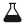

# LaboOpgave 1

We gaan nu een titratie maken. Hou je pipetten in pippo..pippet...neen, petto!



**Titreren** \
Wie doet het niet graag?

Ben je er klaar voor?\
\
\_\_\_\_\_\_\_\_\_\_\_\_\_\_\_\_\_

Hier boven moest je dus je schrijven he!








Wat zijn je bevindingen?



